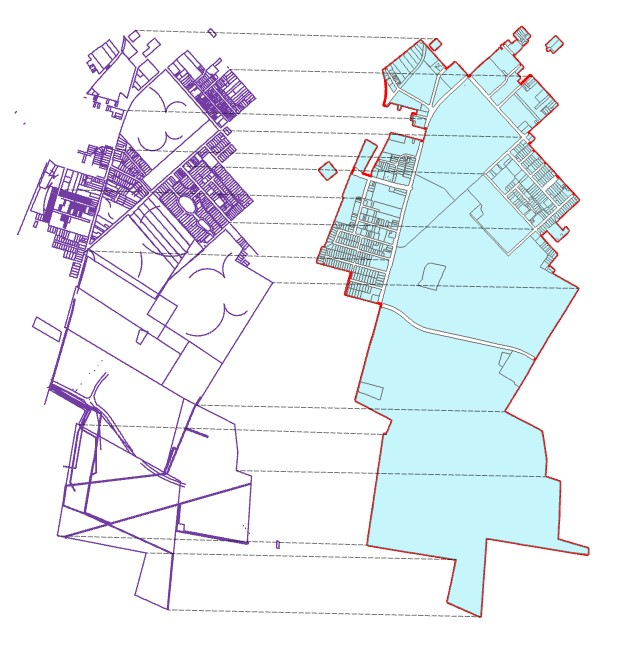
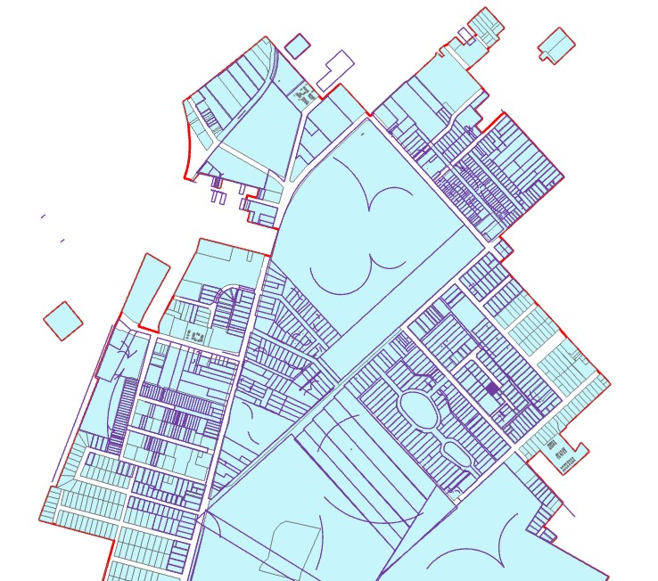

# UK Campus Expansion | Historic Parcel Acquisition

<!-- TOC -->

  - [I. Introduction](#i-introduction)
  - [II. Methodology](#ii-methodology)
    - [A. Data & Processing](#a-data--processing)
    - [B. Design - Application Layout](#b-design---application-layout)
  - [III. Conclusion](#iii-conclusion)

<!-- /TOC -->

## I. Introduction

The University of Kentucky was founded in 1865 as a Land-Grant Institution. The original campus was located at the Ashland Estate, the University did not move to its current location until 1880. UK opened at its current location in 1882 with three buildings (Administration Building, White Hall Dormitory, and President Patterson House - White Hall and Patterson House were demolished in the 1960's for the development of Patterson Office Tower and White Hall Classroom Building). Since then UK Lexington Main Campus has grown to xxxxx building xxxx acres

In my current position with the University of Kentucky - ITS Information Services, I work closely with UK Facilities Management and their datasets. Our department has identified a need for historic parcel/plat data to be digitized and made available in an easy to use map environment. This is something our department has wanted to complete for a while, but have not been able to get funding to support the development.I am proposing to design an interactive map that will allow users to easily search and view University of Kentucky owned parcels. There is not a single location for this data. Finding additional information requires digging through deed books and various documents. More recent parcel data can be obtained from the LFUCG PVA; but older sections of campus have been merged into large parcels, instead of the original parcel size they were purchased at. Some historic data is currently in a CAD DWG, which would need to be geospatially referenced and digitized. Another pressing need is that the CAD document is maintained by a single person. With many folks retiring, it is important that a resource is available before the 'keeper' of this data retires.
I want to design a map that explores historic parcel ownership/purchases of the University of Kentucky on the Lexington main campus. Important to identify when the University of Kentucky purchased specific parcels on main campus, from who (person, organization, etc.), and the original size. 

## II. Methodology
This project compiles multiple data sources to develop a unique data set that combines modern parcels data and historic UK property acquisitions. UK basemap features were provided from **[UK ITS Information Services - Geospatial](https://www.uky.edu/gissupport/sites/www.uky.edu.gissupport/files/Campus_Feature_Descriptions_0.pdf )**. Historic UK parcel data was provided by UK Facilities Management & UK ITS Information Services - Facilities Library. Modern Fayette County Parcel Data was sourced from **[Lexington Fayette Urban County Government (LFUCG)](https://data-lfucg.hub.arcgis.com/datasets/e4a525d8772741468205e82fc173db22_0/about)**. 

### A. Data & Processing
**UK Ownership Boundary**
(UK ITS Information Services - Geospatial)

**UK Basemap Features**
(UK ITS Information Services - Geospatial)
  - https://www.uky.edu/gissupport/sites/www.uky.edu.gissupport/files/Campus_Feature_Descriptions_0.pdf 
  - File created on UKY GIS Support Data page - September 29, 2021
  - Downloaded on February 2, 2022 as shapefiles	- Consists of: UK Buildings, Pavement, Road Centerline, Acquisition Boundary
  - Downloaded shapefile in projection NAD 1983 StatePlane Kentucky FIPS 1600 (US Feet)
  - Converted shapefile to a geodatabase using the ArcPro Geoprocessing Tool 'Feature Class to Geodatabase'
  - The information contained in this file is from multiple data sources maintained by the University of Kentucky’s ITS Information Services

**Fayette County Parcel Data**
(LFUCG)
  - https://data-lfucg.hub.arcgis.com/datasets/e4a525d8772741468205e82fc173db22_0/about
  - File created on LFUCG HUB - January 4, 2022
  - Downloaded on February 2, 2022 as a shapefile
  - Downloaded shapefile in WGS 1984, 4326, EPSG --> converted to projection NAD 1983 StatePlane Kentucky FIPS 1600 (US Feet) using Geoprocessing ArcPro 'Project Tool' 
  - Converted shapefile to a geodatabase using the ArcPro Geoprocessing Tool 'Feature Class to Geodatabase'
  - Clipped parcel data to the UK Acquisition layer (UK Basemap Features) using the ArcPro Geoprocessing Tool 'Clip Layer' to reduce size of data 
  - Credits: LFUCG GIS, LFUCG Addressing, LFUCG Planning, Fayette County Property Valuation Administrator (PVA)

**Historic UK Parcel CAD Data**
(UK Facilities Management & UK ITS Information Services - Facilities Library)
  - Original data was developed using existing deed and plat information - NOT SURVEY QUALITY 
  - Parcel attributes were taken from the deeds and/or existing subdivision plats
  - Data is not complete and only shows parcels as described when they were conveyed to UK and does not show subsequent sales for road widening, easements, etc.
  - Converted CAD to GDB using the ArcPro Geoprocessing Tool 'CAD to Geodatabase'
  - CAD data was not in a projected space, assigned the converted data a  projection NAD 1983 StatePlane Kentucky FIPS 1600 (US Feet)
  - "Georeferenced" converted CAD data to the UK Campus Basemap using the Geoprocessing ArcPro Tool 'Transform Features'- created links between the converted CAD data and GIS campus basemap (see images below)
  - Converted georeferenced CAD Annotations to a point feature class using the Geoprocessing ArcPro Tool 'Feature to Point' 
  

  
  

**UK Parcel Acquisition Data (NEW DATASET)**
(UK ITS Information Services - Geospatial)
  - After georeferencing the Historic UK Parcel CAD data to the GIS UK basemap, created a new feature class (UK Parcel Acquisition) from the Fayette County Parcel data and added/edited new features from georeferenced Historic UK Parcels 
  - Combined the dataset attributes by performing a spatial join using the ArcPro Geoprocessing Tool 'Spatial Join', joined georeferenced CAD Annotation points to the new UK Parcel Acquisition layer that we were completely within a parcel feature
  - Assigned unique IDs by using the ArcPro Geoprocessing Tool 'Number Features'

**UK Points of Interest - POI (NEW DATASET)**
(UK ITS Information Services - Geospatial & UK Libraries - Explore UK)
  - Selected historic photos of UK campus from https://exploreuk.uky.edu/ that could be recaptured today (Rephotography) 
  - Identified locations in historic photos based on key landmarks
  - Photos edited using Adobe Photoshop

### B. Design - Application Layout
Create a full screen interactive map that will allow users to explore the history of campus expansion and relive history through various points of interest on campus. The map will include three separate layers: Parcels, Buildings, and Points of Interest (POI). 

User Interaction includes:
- Search by Parcel Address, Deed Address, Grantor, or Point of Interest 
- Timeslider starts with the initial acquisition of campus from Lexington, and show additional parcels as they were purchased to 2022
- Deed Information pop-up - information on deed from UK Parcel Acquisition Data layer
- Point of interest pop-up - name of location and a historic photo from that area with a description. When a feature is clicked a modal window with image comparison slider will open, allowing users to compare historic images to the location today. 
- Layer List toggle parcels, buildings, points of interest, current aerial imagery 
- Info button
- Zoom control 

## III. Conclusion

Provide a brief (one or two paragraphs) statement to conclude the proposal. This will likely be restating what you said in the introduction, but also (re)consider the format we used in the first assignment (a topic with a motivating question).

NOTES: 

https://www.re.photos/en/ 

https://libraries.uky.edu/libpage.php?lweb_id=311&llib_id=13
